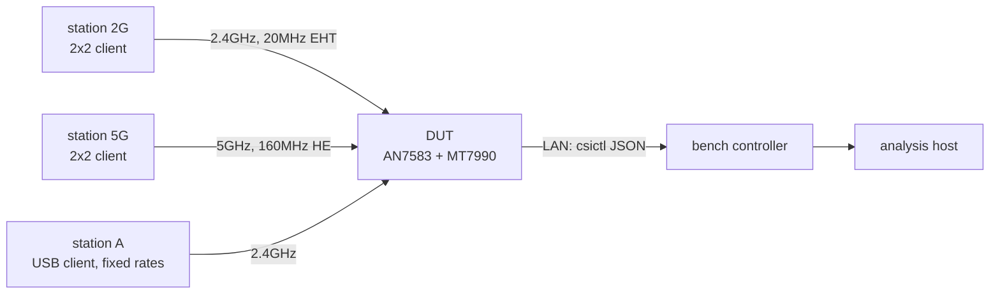
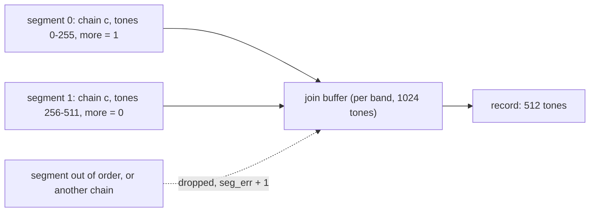
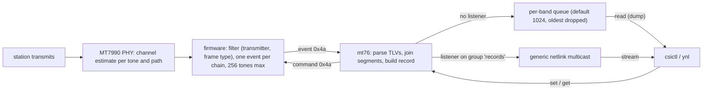

## Abstract

Wi-Fi sensing relies on Channel State Information (CSI): one complex channel estimate per
subcarrier and antenna path for every received frame. It is usually collected on the client
side with a few research network cards and patched drivers. This paper shows that the MT7990
Wi-Fi 7 access-point radio reports CSI for the frames of chosen stations using a patched
open-source mt76 driver, and describes how to collect it, what it contains and how reliable
it is.

The firmware command has 06 sub-commands, and its filters take effect only when sent before
the start command. Each event carries one antenna path of one frame with at most 256
subcarriers, so 160MHz frames arrive in two segments.

The custom `mt76` integration adds a parser, a segment join buffer, a record queue and a
multicast stream behind a generic netlink family, plus a command-line tool.

The records are characterised: tone layout and null tones,
chain-to-antenna mapping, RSSI in dBm, SNR in dB after removing a +16 offset, a firmware
timestamp that is always zero, and a CSI rate of 12-14 frames per second under light traffic.

Against an independent channel estimate from raw baseband samples of the same frames, the CSI
magnitude profile correlates at 0.94 (0.46dB RMS difference in the band centre) and the phase
profile at 0.90. With a 1s spread-of-amplitude metric, a person walking in the room raised the
5GHz 160MHz score from 0.08dB (still) to a median of 0.39-1.77dB in two runs, with no
overlap between still and walking windows.

At 2.4GHz 20MHz the two overlapped; receiver-gain steps, notched records and a flat line-of-sight
channel account for it. Capture costs 1-4% of the AP's CPU and no measurable throughput.

---

## Contents

1. [Introduction](#1-introduction)
2. [Background](#2-background)
3. [Test setup and method](#3-test-setup-and-method)
4. [The firmware interface](#4-the-firmware-interface)
5. [Linux integration](#5-linux-integration)
6. [What a record contains](#6-what-a-record-contains)
7. [Data quality](#7-data-quality)
8. [Motion sensing](#8-motion-sensing)
9. [Cost](#9-cost)
10. [Limitations](#10-limitations)
11. [Future work](#11-future-work)
12. [Artifacts and reproducibility](#12-artifacts-and-reproducibility)
13. [Credits](#13-credits)
- [Appendix A: record schema](#appendix-a-record-schema)
- [Appendix B: command and event reference](#appendix-b-command-and-event-reference)
- [Appendix C: glossary](#appendix-c-glossary)

---

## 1. Introduction

A Wi-Fi receiver estimates the radio channel on every OFDM frame in order to equalise the
data. That estimate (the CSI), describes how the room shapes the signal, and it changes when
people move, breathe or open a door. Some research has used it for presence detection,
activity and gesture recognition and localisation. Almost all of that work ran on a handful of
client cards with modified firmware, not on the access point that is already in every home.

The MT7990 firmware contains a CSI engine, and the command that drives it is present in the
production image, but the upstream Linux driver did not have the code to use it.

**Contributions.**

- The command and event format, read from the Wi-Fi MCU firmware and confirmed on the device,
  including the ordering rule that decides whether any data arrives at all (section 4).
- A Linux integration in mt76 with a generic netlink interface, a queue and a live stream
  (section 5).
- A measured description of the records: layout, units, rates, and which fields cannot be
  trusted (section 6).
- An accuracy check of the firmware's CSI against an independent estimate from raw baseband
  samples of the same frames (section 7).
- A motion-sensing experiment on two bands with a simple, reproducible metric, including the
  band where it fails (section 8).
- The cost to traffic and CPU (section 9).

---

## 2. Background

**CSI.** For each OFDM subcarrier `k` and each pair of transmit stream `s` and receive antenna
`r`, the receiver estimates the complex channel `H_sr(k) = I + jQ`. `|H|` is the amplitude
response and `arg H` the phase response.
Frequency-selective fading shows as notches where multipath components cancel.

**Subcarrier grids.** Legacy, HT and VHT frames use a 312.5kHz subcarrier spacing, 64 tones
per 20MHz. HE and EHT use 78.125kHz, 256 per 20MHz. The MT7990 reports HE/EHT CSI at every
4th subcarrier, so the tone counts match the legacy grid: 64, 128, 256 and 512 tones for
20, 40, 80 and 160MHz.

**Phase.** Each frame's phase carries a slope across tones (the receiver's timing offset for
that frame) and a constant (carrier phase). Both are random per frame. Removing a
straight-line fit across the used tones ("sanitising") leaves the channel's own phase shape.

**Antenna paths.** A 2-stream station received on 3 antennas gives 6 paths per frame. Each is
reported separately as a "chain".

---

## 3. Test setup and method



*Figure 1: the setup.*

- **DUT.** A test unit with the Airoha AN7583 SoC (4 × Cortex-A53) and the MT7990
  radio, OpenWrt, Linux 6.18, production WM firmware from linux-firmware, custom mt76 driver. The
  2.4GHz radio uses 2 receive antennas and the 5GHz radio 3.
- **Stations.** Two 2×2 laptop clients (one per band) for the CSI captures and the motion
  runs; a USB client with pinnable rates (station A) for the cross-check of section 7.
- **Traffic.** CSI needs the station to transmit: pings from the AP at 2.4GHz (the replies
  carry CSI), a steady 1Mbit/s upload at 5GHz.
- **Evidence markers.** [F] firmware fuzzing; [M] measurement on the DUT; [A] offline analysis of
  recorded data.

---

## 4. The firmware interface

### 4.1 Commands [F][M]

UNI command `0x4a`, sent to the WM MCU, carries a 4-byte header `{band, reserved[3]}` and one
TLV (`le16 tag, le16 len`, `len` including the 4-byte TLV header):

| Tag | Sub-command | Body | Effect |
|---|---|---|---|
| 0 | STOP | — | capture off, callback removed |
| 1 | START | — | capture on |
| 2 | FRAME_TYPE | `u8 idx, u8 type` | idx 0-3: frame-type slots (`type` = 802.11 type \| subtype << 2; 34 = QoS data); idx >= 4: send one frame to WCID `type` now |
| 3 | CHAIN_NUMBER | `u8 func, u8 value` | which antenna paths are reported (below) |
| 4 | FILTER_MODE | `u8 op (1 add, 0 delete), u8 pad, u8 mac[6]` | transmitter filter |
| 5 | ACTIVE_MODE | `le16 interval_ms, u8, u8, le32 wcid_bitmap` | the AP polls the listed stations in turn |

**Ordering rule [M].** Frame-type and transmitter filters take effect only when they reach the
firmware *before* START. START alone was accepted (status 0) but produced no events, and
filters sent after START produced none either. STOP, then FRAME_TYPE 34, then the transmitter
filter, then START gave 68 events from 20 pings. The driver therefore applies a combined
request in a fixed order: filters, chain selection, active mode, start.

**Chain selection [M].** The meaning of the CHAIN_NUMBER values was not documented and was
decoded on the DUT from 07 settings under a 5GHz upload:

| `func` | `value` | Paths reported (5GHz, 2 streams × 3 antennas) |
|---|---|---|
| 0 | n | path n only |
| 1 | n | the first n paths |
| 2 | s | all antennas of TX stream(s) |
| 3 | r | antenna r of every TX stream |

**Hazard [F].** The firmware's TLV loop has no minimum-length check, so a TLV with `len = 0`
would make the WM loop forever. This was not tried: the driver builds every TLV itself and
never sends one. No CSI command caused a firmware timeout during this work.

**Active mode [F][M].** The firmware walks the WCID bitmap (WCIDs 0-31 only) and sends each
station a 24-byte header-only frame every `interval / count` ms. It ignores the two type bytes
and refuses an empty bitmap or an interval shorter than 1ms per station. On the DUT, active
mode produced no poll-driven records with any setting tried (section 10).

### 4.2 Events [F][M]

Each event (UNI event `0x4a`, unsolicited) carries `{band, pad[3]}`, then one UNI TLV whose
value is a list of `{le32 tag, le32 len, body}` elements in any order:

| Tag | Field | Notes |
|---|---|---|
| 0 | version | 22 on this firmware |
| 1 / 8 | channel / PPDU width | 0 = 20 ... 4 = 320MHz |
| 2 / 3 | RSSI / SNR | per chain; dBm / dB + 16, 0 = no estimate |
| 5 | tone count | of this segment, at most 256; 13 for a second record kind |
| 6 / 7 | I / Q | 16-bit per tone |
| 9 | primary 20MHz index | |
| 10 | transmitter address | 6 bytes + 2 pad |
| 12 | RX mode | bits 15-0 PHY mode (1 OFDM, 2 HT, 4 VHT, 8 HE, 15 EHT), 31-16 rate |
| 17 | chain info | bits 3-0 chain, 7-4 chains in the PPDU, bit 15 last chain, 31-16 PPDU sequence |
| 18 | TX/RX index | bits 15-0 RX antenna, 31-16 TX stream |
| 19 | timestamp | always 0 with this firmware image [M] |
| 20 | sequence | 802.11 sequence number |
| 21 / 22 | segment / more | segment number; 1 while more segments follow |
| 23 | streams | bits 3-0 TX streams, 7-4 RX streams |

The firmware sent tags 0-12 and 17-23, never 13-16. One event is one chain of one PPDU, so a
frame from a 2-stream station received on 3 antennas produces 6 events. Frames wider than
80MHz are split into 256-tone segments, sent back to back for one chain:



*Figure 2: segment join for 160MHz frames.*

**Second record kind [F].** The firmware also builds records with 13 tones (width code 6, one
TX and one RX, SNR 0), packed into the usual 64-entry I/Q arrays after sign-extending 14-bit
samples. They could not be triggered on the DUT: 1Mbit/s DSSS frames gave no CSI at all, and
6Mbit/s OFDM frames gave 1000 normal 64-tone records.

---

## 5. Linux integration



*Figure 3: data path.*

- **Parser.** Order-independent TLV parsing with bounds checks. A malformed event increments
  `parse_err`. Records are copied out of the event in softirq context (atomic allocation).
- **Join buffer.** One per band, sized for 1024 tones (320MHz). A segment that does not
  continue the current chain resets it and increments `seg_err`.
- **Queue and stream.** Without a listener, records wait in a per-band queue (default 1024,
  up to 16384; a 160MHz record is about 2.1 KB). When a process listens on the multicast
  group `records`, records bypass the queue and are streamed as they arrive. Counters
  (`events`, `pushed`, `streamed`, `dropped`, `seg_err`, `parse_err`) are readable at any
  time. STOP, a firmware restart or `enable 0` end the capture and drop the queue.
- **Generic netlink family `mt76-csi`**, described by a YNL specification from which the
  kernel policy and UAPI header are generated. Commands: `set` (filters, chain selection,
  active mode, queue length, enable), `get` (state and counters), `read` (dump of queued
  records); notification `record-ntf`.
- **Tool.** `csictl <if> <band> set | start | stop | status | read | watch | stream` prints one
  JSON object per record.

---

## 6. What a record contains

### 6.1 Layout [M]

`i` and `q` are in FFT order: index 0 is DC, the first half the positive subcarriers, the
second half the negative ones (`fftshift` for a frequency axis). Null tones read 0 and must be
masked before taking logarithms or fitting phase. In a 160MHz record the zero tones are the
band edges (-256..-254 and 254..255), the DC of each 80MHz half (±128) and the centre
(-2..2).


*Figure 4: one 160MHz PPDU from the 5GHz station, all 6 paths (2 streams × 3 antennas).
Frequency-selective fading differs per path; stream 1 to antenna 2 has a 25dB notch.*

Chain `k` of a PPDU is the pair (`trx_idx >> 16` stream, `trx_idx & 0xffff` antenna). Series
must be kept per (chain, stream count, PHY mode): when a station switches to a single-stream
legacy frame, "chain 0" means something else. In the cross-check run (section 7.3), legacy
24Mbit/s frames from station A all arrived as a single record (1 stream, antenna 0).

### 6.2 Units [M]

| Field | Unit | Evidence |
|---|---|---|
| `rssi` | dBm, per chain | station A: CSI -33..-35dBm while the AP's station table read -33dBm; a close station read -20..-22dBm for a station signal of -21dBm |
| `snr` | firmware: dB + 16; driver reports dB | a 2.4GHz raw value of 56 is 40dB; on the cross-check run the driver reported a median of 40dB where the L-LTF SNR from raw samples was 45.5dB |
| `ts` | always 0 | every record of every run |
| `rx_time` | host receive time, CLOCK_BOOTTIME ns | added by the driver |

The CSI SNR runs about 5dB below the L-LTF SNR computed from raw samples. The two estimators
differ (the firmware's is per chain, after its own processing), and the offset is consistent
across the run.

### 6.3 How often [M][A]

The firmware does not report every frame:

| Condition | Frames with CSI |
|---|---|
| 5GHz, heavy upload (140-700Mbit/s) | about 25-41 per second; under a 706Mbit/s upload the counters read 3180 events, 1590 records, 122 dropped from a full queue |
| 5GHz, 1Mbit/s upload | 7388 records in 30 s, 6 per frame, about 41 frames per second (11.5 per second in the shipped sample, which keeps every 4th frame) |
| 5GHz, ping replies | almost none: 1 record in 30s of pings at 25 per second |
| 2.4GHz, pings from the AP | 13.5 per second; median gap 24ms, 90th percentile 192ms |
| station A, ping flood, 24Mbit/s legacy | 2454 records in 40 s, about 60 per second |
| stations of other networks | none (0 events) without a transmitter filter, with frame types 34, 32 or 16: only associated stations are reported |
| 1Mbit/s DSSS frames | none |


*Figure 5: time between consecutive frames with CSI in the two sample captures.*

---

## 7. Data quality

### 7.1 Amplitude and phase over time [A]

With the station still, the 5GHz 160MHz channel is stable. The per-tone amplitude standard
deviation over 30s (after removing each record's mean level) is 0.064dB (median over
tones), and the sanitised phase standard deviation is 0.007 rad. At 2.4GHz the figures are
0.23dB and 0.003 rad; the amplitude is less stable there because of receiver-gain steps
(7.2).


*Figure 6: phase of eight 5GHz records before and after removing the linear fit.*


*Figure 7: per-tone standard deviation over a 30s still capture, amplitude and sanitised
phase.*

### 7.2 Gain steps and notched records [A]


*Figure 8: mean level of each record (chain 0) over 30s with the station still.*

At 2.4GHz the mean level per record falls into discrete clusters about 1dB apart, and it
changed by more than 1dB between consecutive records 148 times in 411 records. The
receiver's gain steps show through because the CSI is not normalised to a fixed gain. 62 of
the 411 records (15%) contain a notched tone: a single tone more than 10dB below the
record's median that is absent from the neighbouring records. At 5GHz there were 14 steps in
344 records and no notched records.

Before comparing records, normalise each record's level (subtract its mean in dB) and drop
records with notched tones. The motion metric of section 8 does both.

### 7.3 Accuracy: CSI against an independent estimate [M]

To check the firmware's CSI, CSI and raw baseband samples of the same frames were recorded at
the same time. The raw samples came from the chip's I/Q capture engine (described in the
companion ICAP whitepaper). Station A sent legacy 24Mbit/s frames under a ping flood for
40 s; the AP recorded 2454 CSI records (antenna 0) and 400 captures of RX path 0. The legacy
long training field (L-LTF) of 63 of station A's frames in those captures gave an independent
channel estimate per subcarrier: the average of the two LTF symbols, after the capture's
sample-timing repair.


*Figure 9: mean channel shape per subcarrier from CSI (2454 records) and from the L-LTF of
raw captures (63 frames), same station, antenna and period. Left: magnitude with mean removed,
± 1 s.d.; right: sanitised phase.*

| Comparison | Value |
|---|---|
| magnitude profiles, correlation | 0.94 |
| magnitude, RMS difference (all 52 tones / inner 40 tones) | 0.84dB / 0.46dB |
| band-edge roll-off (outer 3 tones against the centre) | CSI -2.4dB, raw L-LTF -4.5dB |
| sanitised phase profiles, correlation | 0.90 |
| sanitised phase, RMS difference | 0.021 rad |
| per-tone spread across frames | CSI 1.71dB, raw 1.56dB |

The shapes agree across the band. The main difference is at the band edges, where the raw
samples roll off 2dB more, consistent with the firmware estimating the channel after
compensating the receive filter's passband while the capture tap sits after the filter. CSI
antenna 0 and capture path 0 are the same receive chain. The per-frame spread is similar in
both, so the CSI adds no visible noise of its own at this SNR.

### 7.4 Cyclic-shift ripple [A]

A 2-stream station sends the legacy preamble with a cyclic shift on its second antenna. In
the received sum this appears as a periodic ripple across tones. At 2.4GHz the 2×2 laptop
shows notches every 16 tones (5MHz), a 200 ns shift, in raw-sample channel estimates. Paths
of the same stream share the ripple; its phase differs between streams. Keep series per
stream when this matters.

---

## 8. Motion sensing

### 8.1 Metric [A]

A first metric, one minus the correlation of consecutive records, was dropped: gain steps and
notched records moved it as much as motion did. The metric used here removes both effects
first.

For each record: amplitude in dB over the used tones, minus its mean (removing gain steps);
records with a notched tone are dropped. For each antenna path and 1s window: the standard
deviation over time of each tone, averaged over tones. The score is the average over paths,
in dB: 0 for a frozen channel, larger when the multipath changes. It is implemented as
`csiplot.py motion` in the tool package.

### 8.2 Experiment [M]

Twice per band: 30s with the room still (station at a fixed place), then 30s with a person
walking around the room. Run 2 crossed the line of sight more often.

| Run | Band | Still median / p90 / max | Walking median / p90 / max |
|---|---|---|---|
| 1 | 5GHz HE160 | 0.082 / 0.092 / 0.114dB | 0.386 / 0.791 / 1.587dB |
| 2 | 5GHz HE160 | 0.084 / 0.100 / 0.131dB | 1.771 / 2.063 / 2.121dB |
| 1 | 2.4GHz EHT20 | 0.313 / 0.566 / 0.702dB | 0.230 / 0.354 / 0.511dB |
| 2 | 2.4GHz EHT20 | 0.255 / 0.424 / 0.757dB | 0.373 / 0.473 / 0.700dB |

Computed from the run-2 samples (5GHz keeps every 4th frame): 5GHz still
0.078 / 0.096 / 0.122dB, walking 1.622 / 2.028 / 2.073dB (minimum 0.457dB); 2.4GHz
unchanged.


*Figure 10: 5GHz chain 0, deviation of each tone from its median over 30 s. Top: still.
Bottom: a person walking; crossings of the line of sight show as band-wide stripes.*


*Figure 11: motion score per 1s window, run 2 samples.*

### 8.3 Separation, and why 2.4GHz fails [M][A]

At 5GHz 160MHz, every walking window scored above the highest still window in both runs:
5× the still median in run 1 and 21× in run 2. A threshold at about 2.5× the median of a
still calibration capture (0.2dB here) separates them. Run 1's lowest walking window
(0.13dB) sat just above the still maximum, so short pauses while walking read as still.

A still capture can itself contain motion. A first attempt at run 2 read 0.24-0.52dB for its
first 7s while someone settled, then 0.09dB.

At 2.4GHz 20MHz the still and walking scores overlap in both runs. The contributing
factors, all measured above:

- 64 tones instead of 512, and 4 paths instead of 6;
- a nearly flat channel: the station was close and in line of sight;
- 1dB receiver-gain steps and 15% notched records (7.2), which raise the still floor to
  0.26-0.31dB;
- a lower and more irregular CSI rate from pings (median gap 24ms, 90th percentile 192ms).

---

## 9. Cost [M]

Download traffic is unaffected: CSI is measured on frames the station sends. Upload and
latency were measured with the capture off and on, interleaved, with the same stations
(Mbit/s; ping to the station during the upload):

| Band, rounds | CSI | Upload | Ping average | Firmware events /s |
|---|---|---|---|---|
| 5GHz HE160, 5 | off | 288-838, mean 576 | 10-56ms | 0 |
| 5GHz HE160, 5 | all 6 chains | 171-750, mean 443 | 6-44ms | 270-590 |
| 5GHz HE160, 5 | one chain | 199-671, mean 454 | 12-94ms | 45-100 |
| 2.4GHz EHT20, 2 | off | 159-189 | 105-111ms | 0 |
| 2.4GHz EHT20, 6 | on (filtered, unfiltered, streamed) | 117-200 | 103-124ms | 220-310 |

No difference stands out from the run-to-run spread of the stations' own uplink, which varies
by a factor of three at 5GHz with the capture off. The DUT's CPU stays at 1-4%. Formatting
512-tone records as JSON on the DUT itself (`csictl stream` running locally) adds 17-22%, so
long captures should stream to another host or be narrowed with the chain selection of
section 4.1.

---

## 10. Limitations

- **One room, one station position per band, two runs.** The motion results show that the
  metric separates still and walking on this bench at 5GHz. They give no detection rates for
  other rooms, distances or activities, and the threshold must be calibrated per room.
- **Humans in the loop.** The walking runs were done by a person on the bench; their paths
  are not recorded precisely.
- **Accuracy check at high SNR only.** The CSI-against-raw comparison (7.3) was at about
  40dB SNR, with legacy frames and one antenna. Differences at low SNR, for HE/EHT frames or
  on other antennas are untested. The reference estimate also shares the same RF front end,
  so errors common to both are invisible.
- **Sampling of frames.** The firmware decides which frames carry CSI (25-40 per second under
  heavy traffic). The selection rule is unknown and could bias time series.
- **Undocumented feature.** This data was probed and read without documentation, its behaviour or format can change in the future.
- **Need traffic flowing**. An idle station did not produce records.

## 11. Future work

- **Active mode.** Find out why the AP's polls produce no records: whether the poll frame gets
  no response the firmware samples, or CSI on responses is filtered out. Can we somehow wake the station?
- **Firmware timestamp.** A per-frame firmware time would allow sub-millisecond alignment
  across chains and with the AP's own transmissions.
- **Multi-link (MLD) stations.** Map CSI to the link and the MLD station.
- **Host-side decimation and per-station rate control**, to bound the event load.
- **CSI as a diagnostic metrics.** CSI already served to verify the AP's power-saving antenna
  switch-off: with it active, a 2.4GHz frame's records dropped from 4 to 2 chains and RX
  antenna 1 disappeared. Per-antenna health checks follow directly.
- **Combine with raw baseband capture.** Raw captures give the L-LTF and,
  for HE frames, data-aided estimates. CSI gives every antenna and a steady rate.

## 12. Artifacts and reproducibility

| Path | Content |
|---|---|
| [data/2g-legacy-xcheck.json.xz](/mt7990-csi/data/2g-legacy-xcheck.json.xz) | the 2454 CSI records of the cross-check run (section 7.3), transmitter address replaced |
| [data/xcheck-profiles.csv](/mt7990-csi/data/xcheck-profiles.csv) | the mean magnitude and phase profiles of Figure 9, CSI and raw |
| [data/summary.json](/mt7990-csi/data/summary.json) | every number computed for this article from the data |
| [scripts/make_figures.py](/mt7990-csi/scripts/make_figures.py) | regenerates all figures and data |
| `drivers` | TBD |
| `csictl` | TBD |

The four motion-run captures (2.4GHz and 5GHz, still and walking, run 2, transmitter
addresses replaced, 5GHz every 4th frame) ship with the tool package as
`utils/csictl/samples/*.json.xz`. The script reads them from there.

To regenerate:

```sh
$ python3 scripts/make_figures.py <feed-checkout> <cross-check-raw-dir> .
```

## 13. Credits

- Anthropic/Claude
- F.
- M.

---

## Appendix A: record schema

One JSON object per record (`csictl read` / `stream`); the netlink attributes carry the same
names:

```json
{"band":0,"ts":0,"rx_time":35484837308673,"ta":"02:00:00:00:00:01","rssi":-34,"snr":40,
 "cbw":0,"dbw":0,"ch_idx":0,"rx_mode":720897,"chain_info":98320,"trx_idx":0,"tr_stream":17,
 "pkt_sn":111,"extra_info":0,"ver":22,"i":[734,540,...],"q":[...]}
```

| Field | Meaning |
|---|---|
| `band` | 0 = 2.4GHz, 1 = 5GHz |
| `ts` | firmware timestamp (always 0) |
| `rx_time` | host receive time, CLOCK_BOOTTIME ns |
| `ta` | transmitter address |
| `rssi`, `snr` | dBm, dB (`null` when the firmware has no estimate) |
| `cbw`, `dbw` | channel and PPDU width code |
| `ch_idx` | primary 20MHz index |
| `rx_mode` | bits 15-0 PHY mode, 31-16 rate |
| `chain_info` | bits 3-0 chain, 7-4 chains in the PPDU, bit 15 last chain, 31-16 PPDU sequence |
| `trx_idx` | bits 15-0 RX antenna, 31-16 TX stream |
| `tr_stream` | bits 3-0 TX streams, 7-4 RX streams |
| `pkt_sn` | 802.11 sequence number |
| `i`, `q` | per tone, FFT order |

## Appendix B: command and event reference

Command: UNI `0x4a` to the WM MCU; `{u8 band, u8 reserved[3]}` + one TLV; tags in 4.1.
Sequence for one station:

```sh
csictl <if> <band> set frame 0 34 peer-add <station> enable 1   # filters, then START
csictl <if> <band> stream > csi.json                            # records as they arrive
csictl <if> <band> status                                       # counters
csictl <if> <band> stop                                         # STOP, queue dropped
```

Event: UNI `0x4a`, unsolicited; `{u8 band, u8 pad[3]}` + UNI TLV 0 holding
`{le32 tag, le32 len, body}` elements; tags in 4.2.

## Appendix C: glossary

| Term | Meaning |
|---|---|
| CSI | channel state information: complex channel estimate per subcarrier and path |
| chain / path | one transmit stream to one receive antenna |
| L-LTF | legacy long training field, the channel-estimation symbols of every OFDM frame |
| PPDU | PHY protocol data unit, one transmitted frame including its preamble |
| sanitised phase | phase minus its linear fit across tones |
| WCID | the AP's index for an associated station |
| WM | the Wi-Fi chip's main microcontroller firmware |
