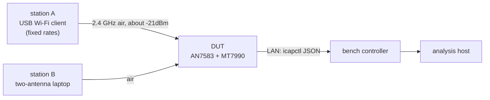
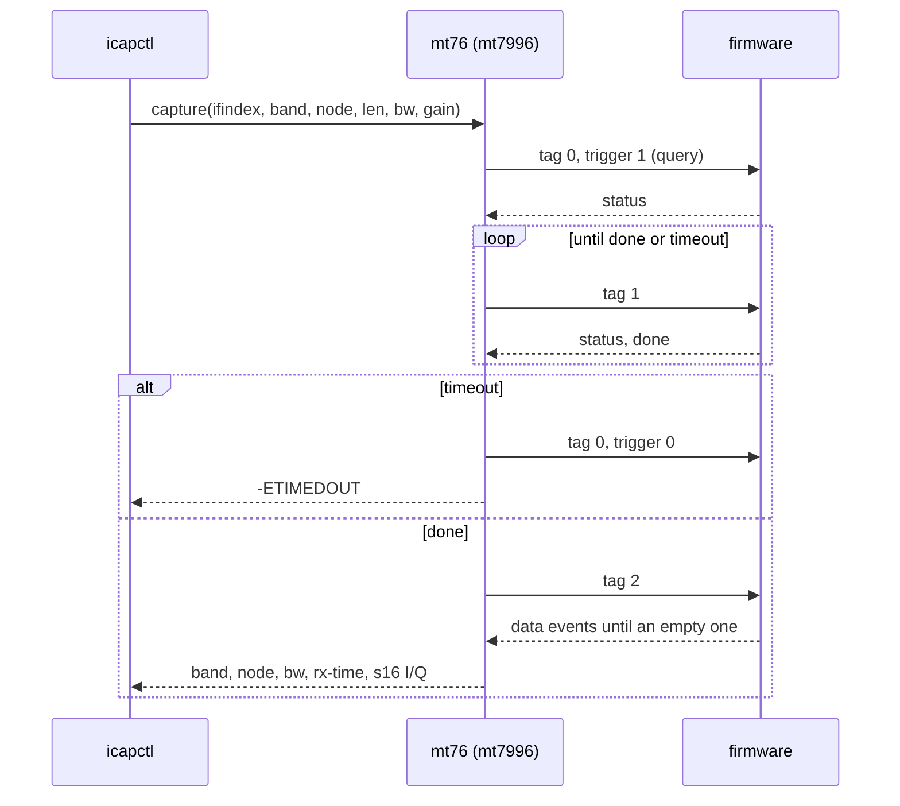
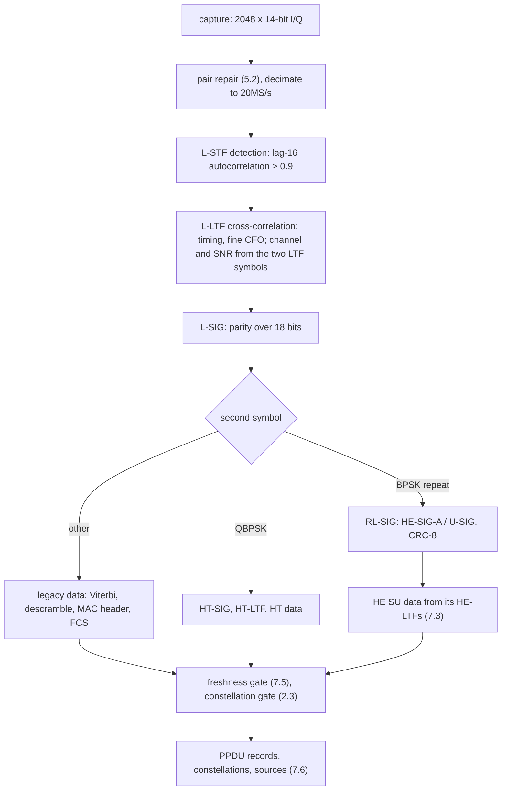
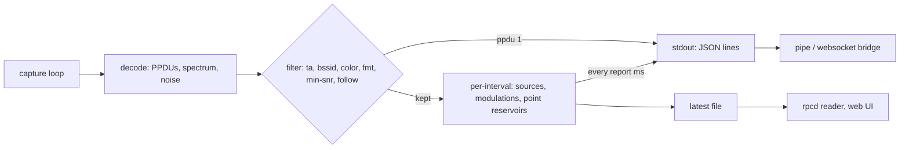

## Abstract

Production Wi-Fi access points expose statistics (RSSI, per-station SNR, rate counters) but
not the received signal itself.

In this research, we will show that the MT7990 Wi-Fi 7 radio, running its mainline
production firmware with a patched mt76 Linux driver  can deliver raw complex
baseband samples (I/Q) of its receive chain on demand, and that these samples are good enough
to demodulate 802.11 PPDUs of every OFDM generation up to HE and to draw resolved
constellations up to 256-QAM.

We probed the Wi-Fi MCU, controlled experiments on a
development unit, and a decoder written for the purpose, and found:

1. **The capture command and its issues.** A spectrum/capture command runs one 2048-sample
   capture at a time. Its MAC-trigger and source-address fields are dead. Reading the capture
   before it completes, or using ring mode, hangs the firmware.
2. **A sample-timing defect.** Every odd sample is taken half a sample period
   late. An exact per-frequency-pair inverse turns a 16-QAM frame from -10.6dB EVM into
   -27.0dB, and L-SIG from about -4dB into -30dB.
3. **Only part of each capture is fresh.** A free-running capture holds about 57us of fresh
   signal; the rest of the window is older capture memory. A capture armed while the AP itself
   transmits is fresh to the end and holds the peer's response.
4. **An EVM floor.** It sits at -27.6dB for legacy data and about -30dB for L-SIG and HE
   data. It doesn't move with receiver gain, and it is 8-12dB better than the transmitter EVM
   of the second client tested. It lies in the transmitter plus the capture chain.

A rate sweep of a bench station resolved BPSK, QPSK, 16-QAM, 64-QAM and 256-QAM grids.
1024-QAM (mean -30.1dB, gate -33.1dB) is not resolved. We integrated the capture as an mt76
driver feature with a generic netlink family, and wrote a decoder in Python and in C.

The C decoder runs on the access point's Cortex-A53 at 43 decoded captures per second and streams
per-source metrics as JSON for a web front end.

---

## Contents

1. [Introduction](#1-introduction)
2. [Background](#2-background)
3. [Test setup and method](#3-test-setup-and-method)
4. [Recovering the firmware interface](#4-recovering-the-firmware-interface)
5. [Characterising the capture chain](#5-characterising-the-capture-chain)
6. [Driver and user-space interface](#6-driver-and-user-space-interface)
7. [Decoder](#7-decoder)
8. [Evaluation](#8-evaluation)
9. [Live monitoring pipeline](#9-live-monitoring-pipeline)
10. [Limitations](#10-limitations)
11. [Future work](#11-future-work)
12. [Artifacts and reproducibility](#12-artifacts-and-reproducibility)
13. [Credits](#13-credits)
- [Appendix A: data formats](#appendix-a-data-formats)
- [Appendix B: capture-node table](#appendix-b-capture-node-table)
- [Appendix C: glossary](#appendix-c-glossary)

---

## 1. Introduction

Error Vector Magnitude (EVM) and the constellation diagram are the standard way to judge a
digital radio link. In Wi-Fi they are measured with vector signal analysers on a conducted
link, or with the chip vendor's test-mode firmware, and not on a deployed access point (AP)
carrying traffic. Yet an AP sees every client's transmitter.

A per-client EVM and a live constellation would separate a bad transmitter from a bad channel,
show interference, and showcwhat modulation a link can actually carry.

Modern Wi-Fi chips contain a capture engine for factory calibration and debugging. It records
baseband samples from selectable probe points ("nodes") into on-chip memory. On MediaTek
connac3 chips this engine is reachable through a firmware command even with the production
firmware. It is undocumented, and the open-source driver doesn't use it.

**Contributions.**

- A capture command from the Wi-Fi MCU firmware: fields, register
  effects, capture length, dead fields and issues (section 4).
- A measured characterisation of what the capture contains: probe taps, sample rate, a
  half-sample timing defect in every other sample with an exact inverse, the fresh/stale
  structure of the window, the AGC behaviour and the EVM floor (sections 5, 8).
- A safe driver integration in mt76 with a generic netlink family described by a YNL
  specification, and a command-line tool (section 6).
- A decoder for legacy, HT, HE and EHT preambles and for HE SU data without a
  standard-mandated training table, with constellation gating rules that keep unresolved
  grids out of the plots (section 7).
- An on-device live monitor that turns captures into periodic, filterable JSON reports
  (section 9).

Erratas are reported as well: the firmware's MAC-address trigger does not select
frames, ring capture mode hangs the firmware, EHT data could not be equalised, and 1024-QAM is
below the floor.

---

## 2. Background

### 2.1 Platform

| Item | Value |
|---|---|
| AP SoC | Airoha AN7583 (4 x Cortex-A53), OpenWrt, Linux 6.18 |
| Wi-Fi radio | MediaTek MT7990 (Wi-Fi 7, connac3), 2.4 GHz and 5 GHz bands, PCIe |
| Driver | mt76 (`mt7996` family driver), production WM firmware from linux-firmware |
| Host interface | unified firmware commands ("UNI" commands) with TLV payloads, events back |

### 2.2 802.11 OFDM frames in brief

All OFDM Wi-Fi PPDUs (PHY protocol data units) start with the legacy preamble: *L-STF*
(short training, 16-sample period at 20MS/s), *L-LTF* (two 64-sample long training symbols, the
channel estimate) and *L-SIG* (one BPSK symbol: rate and length). Later generations append
their own signal fields:

| Format | After L-SIG | Data subcarriers (20 MHz) | Highest modulation |
|---|---|---|---|
| legacy (11a/g) | data, 64-point FFT, 0.8us guard | 48 | 64-QAM |
| HT (11n) | HT-SIG x2 (QBPSK), HT-STF, HT-LTF | 52 | 64-QAM |
| HE (11ax) | RL-SIG, HE-SIG-A x2, HE-STF, HE-LTF | 234 (256-point FFT) | 1024-QAM |
| EHT (11be) | RL-SIG, U-SIG x2, EHT-SIG, EHT-STF, EHT-LTF | 234 | 4096-QAM |

### 2.3 EVM and when a grid is "resolved"

EVM is the RMS distance between received points and their ideal constellation points,
relative to the RMS constellation amplitude, given in dB (`20 log10`) or percent. We use the
decision-directed form: each point is compared with its nearest ideal point.

Decision-directed EVM saturates: when noise exceeds the cell size, points jump to
neighbouring cells and the measured EVM stops growing. We therefore call a grid **resolved**
only if its EVM is at least 3dB below the *cell EVM*, the EVM of points spread uniformly
over their decision cells:

| Modulation | Cell EVM | Gate (cell EVM - 3dB) |
|---|---|---|
| BPSK / QPSK | -4.8dB | -7.8dB |
| 16-QAM | -11.8dB | -14.8dB |
| 64-QAM | -18.0dB | -21.0dB |
| 256-QAM | -24.1dB | -27.1dB |
| 1024-QAM | -30.1dB | -33.1dB |
| 4096-QAM | -36.1dB | -39.1dB |

For square M-QAM with unit average power the cell half-width is `s = 1/sqrt(2(M-1)/3)`, and a
uniform point in the cell has error power `2 s^2 / 3`.

### 2.4 The capture engine

The chip's capture engine (called RBIST) records samples from a
multiplexer of probe points into a capture RAM. Each probe point, or **node**, is a 32-bit
code: type (RX, TX, radar detector, thermal), category (tap), and sub-fields. A firmware
table maps each node to a selector value, a per-bandwidth sample-rate code and a mode bit.

---

## 3. Test setup and method



*Figure 1: bench.*

- **DUT.** A development board with the AN7583 and MT7990, APs at 2.4 GHz (channel 1, 20 MHz) and 5 GHz
  (160 MHz).
- **Stations.** Station A is a USB Wi-Fi client adapter whose rates can be pinned
  (`iw set bitrates`). Station B is a laptop with a two-antenna client.
- **Bench controller.** A host with shell access to the DUT's LAN side.
- **Traffic.** `ping -f -s 600` from station A gives a dense stream of short single-MPDU
  PPDUs; downloads to station B give a stream of Block Acks.

**Method.** Each claim below comes from one of three sources, marked where it matters:
**[F]** Firmware fuzzing, **[M]** a measurement on the DUT, or
**[S]** a synthetic test with known ground truth. Firmware probing were used on the DUT
where possible (for example the probe-register readback in 4.5).

**Safety rules** (section 4.4): never read capture data before the
engine reports done; never enable ring mode; stop a capture that times out. Otherwise the firmware
will misbehave.

---

## 4. Recovering the firmware interface

### 4.1 Command and tags [F]

The capture is driven by UNI command `0x30` ("spectrum"). Its handler walks TLVs (`u16 tag,
u16 len`; short TLVs are rejected with status `0xc0000001`, unknown tags with `0xc00000bb`).

| Tag | Purpose | Reply |
|---|---|---|
| 0 | set parameters and start (or stop) a capture; 92-byte body | status event: `cap_done` |
| 1 | query status | status event: `cap_done` |
| 2 | fetch data | stream of 1092-byte data events, each up to 256 32-bit sample words; an event with zero words ends the stream |
| 3, 4 | PHY event sniffer (timer, event groups) | periodic event records, no I/Q |

Tags 0 and 1 answer with an event, so the driver sends them as queries.

### 4.2 What the tag-0 fields do [F]

We traced every field of the tag-0 body from the handler to register writes or ROM calls:

| Field (offset) | Effect |
|---|---|
| trigger (+4) | 1 start, 0 stop |
| ring mode (+8) | passed to the engine: capture wraps (see 4.4) |
| trigger event (+12) | written raw to register `0x830a1008`, **after** the engine is started; never reset, so it persists until a firmware restart |
| node (+16) | node-table lookup: probe selector, rate code, mode bit; mux registers `0x830a1004`, `0x830ad440..0x830ad468` |
| capture length (+20) | **only** tells the dump how many of the newest samples to return; the engine always fills the same window |
| stop cycle (+24) | passed to the engine's length/stop call |
| MAC trigger event (+28) | **never copied** |
| source address (+32/+36) | copied, **never read** |
| band (+40) | clocks, gain control |
| bandwidth code (+44) | rate column of the node table: 0 = 20, 1 = 40, 2 = 80, 3/4 = 160, 5 = 320 MHz |
| architecture (+52) | with 1 the done poll is skipped and "done" never becomes true |
| PHY index (+56) | register bank (+`0x100000` per PHY) |
| path (+76), fixed gain (+80) | forced RX gain: 0 = AGC, 1..7 fixed codes |

The capture sequence in the firmware is: force the gain (stage 0); reset and configure both
engine slots; start them; program the mux, the node and the trigger; busy-wait about 50us;
restore the AGC (stage 1, which pulses the MAC's RX-disable bit); report status.

### 4.3 Why a capture is 2048 samples [F][M]

On the DUT, requested lengths of 256, 1024, 2048, 4096, 16384 and 65536 samples returned 512,
2048, 4096, 4096, 4096 and 4096 words: at most 2048 complex samples. A short request returns
the *last* samples of a fixed window. The engine's stop-address register read `0xffc` and its
wrap bit was clear after every capture, whatever the requested length. We speculated that the
dump reads a fixed ring of 1024 128-bit entries in capture RAM.

At this node each entry holds two 14-bit I/Q pairs (96 of the 128 bits), so the ring holds 2048
complex samples. No tag-0 field makes the window longer: the end address and the window size are
constants for this command. A higher bandwidth code only raises the sample rate:

- At 20MS/s a capture spans 102.4us
- At 160MS/s, it's 12.8us.

### 4.4 Potential issues [F][M]

| Action | Result on the DUT | Explanation |
|---|---|---|
| fetch (tag 2) before the status reports done | firmware MCU timeout and kernel panics | the dump reads capture RAM while the engine writes it, causing bus error |
| ring mode | every attempt timed out; one ended in a firmware restart that failed ("hardware became unavailable") | with the wrap flag set, the dump keeps reading about 32 K entries past the end of the 1024-entry ring, leading to ring capture free run |
| architecture = 1 | overruns | the done poll is skipped, so "done" never comes |

The driver therefore polls tag 1 until done, stops the engine (tag 0 with trigger 0) on a
timeout, and never offers ring mode.

### 4.5 The node table [F][M]

The firmware holds a 42-entry node table (Appendix B).

For the RX "filtered" taps (category `0x02` and `0x03`) the rate code steps 3, 2, 1, 0, 0
for 20, 40, 80, 160, 320 MHz, and samples are 14-bit.

We read the probe register back on the DUT after a capture with node `0x00204000` at
20 MHz: `0x830ad448 = 0x00230014`, which is selector 20, rate code 3 and mode bit 21,
exactly the table entry.

---

## 5. Characterising the capture chain

### 5.1 Probe taps [M]

08 captures per node, 2.4 GHz, traffic from station B:

| Node | Tap (from the table) | Observation | Decoded (after the pair repair of 5.2) |
|---|---|---|---|
| `0x00204000` | RX category 2, 14-bit | idle about 100 LSB rms, peaks at 8191 (14-bit full scale during AGC settling), clean OFDM | 2 PPDUs, -12.3dB |
| `0x00204001` | same, low bit set | noise about 20dB higher | none |
| `0x00304000` | RX category 3, 14-bit | idle 25-100 LSB | 3 PPDUs, -18.5dB |
| `0x00304001` | same, low bit set | | 2 PPDUs, about -20dB |
| `0x01100000` | RX category `0x11`, 12-bit, rate code 0 at every width | 12-bit range | none: consistent with an undecimated tap |
| TX `0x104..0x107` | transmit taps | levels change with downlink traffic, no OFDM structure found | none |

Node `0x00204000` was probed first, gave clean preambles and stayed the default. 08
captures per node are too few to rank the taps; `0x00304000` may be better and needs a
proper comparison. The transmit taps remain unexplained.

The **sample rate** at bandwidth code 0 is 20MS/s. Under uplink traffic, a packet start
showed a lag-16 autocorrelation of 1.00 (L-STF, 0.8us period) followed by a lag-64 plateau of
1.00 (L-LTF), and the spectrum of idle captures is flat across the window. Codes 1, 2 and 4
give 40, 80 and 160MS/s. At 5 GHz a DC offset of about +100 / -400 LSB (I / Q) is visible.

Interesting though, the capture does not disturb traffic: frames keep their normal path
while the engine records. There is one engine per device and one RX path per capture.

### 5.2 The sample-pair defect [M][S]

The first decoded frames were wrong in a specific way. Station B's Block Acks
(6Mbit/s, L-LTF SNR 42-45dB) decoded, and the two L-LTF copies agreed to 44dB, yet **L-SIG
EVM was -4.3dB median** (-6.6dB best). It plateaued at -7.7dB for every FFT window offset
inside the guard interval. A good channel estimate paired with a bad data symbol points at the
sampling itself.

Scored by the median L-SIG EVM they produced (-7.0dB unchanged):

| Hypothesis | Best result |
|---|---|
| sample permutations inside groups of 4 or 8, word orders such as IIQQ | -1.6dB (worse) |
| permutations of 2..32-sample blocks | -1.5dB |
| transforms of odd samples (negate, conjugate, multiply by +/-j) | -1.0 to -1.4dB |
| time skew between I and Q (-2..+2 samples) | zero skew best |
| constant I/Q imbalance `x + b x*` | -7.06dB (no gain) |
| wrong symbol spacing or FFT length | guard correlation peaks at exactly 64 and 80 samples |

- The per-tone error, obtained by re-encoding the decoded L-SIG, was larger on tones whose
  k / -k sign relation differed from the L-LTF (-5.9dB) than elsewhere (-10.8dB): an
  image-like term.
- The error flipped sign between packets whose L-LTF started on an even or an odd sample.
- A least-squares fit of one capture against the re-synthesised waveform of a fully decoded
  frame left -7.3dB of residual with a linear channel. Adding a conjugate image left -7.4dB.
  Adding a term periodic in the sample index gave -9.6dB for period 2, -6.9 for 3, -9.7 for 4
  and -10.7 for 32: only even periods help. With separate channels for even and odd samples,
  the residual reached **-14.9dB**, and the two impulse responses visibly differed.
- A single channel with the odd samples delayed by a fractional amount `d` left -8.8dB at
  `d = 0` and **-15.2dB at `d = +0.5`**, falling off symmetrically on either side.

The engine delivers samples in pairs, and **every odd sample is taken half a sample
period late**:

```
captured[2m]     = s(2m)
captured[2m + 1] = s(2m + 1 - 1/2)
```

This fits the capture RAM layout (two I/Q pairs per 96-bit entry, section 4.3): the node
produces two polyphase samples per entry clock.

Split the capture of N samples into its even and odd halves `e[m]`, `o[m]`
(N/2 each) and take their DFTs `E[k]`, `O[k]`. The true spectrum `S` at bins `k` and `k + N/2`
aliases into both halves:

```
E[k] = ( S[k] + S[k+N/2] ) / 2
O[k] = ( a1 S[k] + a2 S[k+N/2] ) / 2,   a1 = exp(j pi k / N),  a2 = exp(j pi (k - N/2) / N)
```

Each pair `(S[k], S[k+N/2])` is a 2x2 linear system with `|det| = |a2 - a1| = sqrt(2)`: well
conditioned at every k, so the repair adds no noise. Solving it and taking the inverse DFT
gives the uniformly sampled signal:

```
S[k]       = 2 (a2 E[k] - O[k]) / (a2 - a1)
S[k + N/2] = 2 (O[k] - a1 E[k]) / (a2 - a1)
```

Capturing at 40MS/s (bandwidth code 1) on the 20 MHz channel,
low-pass filtering and decimating by 2 in software avoids the defect's effect in band. The same
Block Acks then gave L-SIG EVM of -17.2 to -19.8dB, against -5.5dB raw at code 0. The exact
repair on 20MS/s captures gave -18.5dB median (24 packets), the same as the 40MS/s path. On
the 40MS/s stream the repair is harmless. A first guess, that the stream was really 40MS/s
with half the samples missing, was refuted: re-fetching one capture with every value of the
ignored bank, path and I/Q-type fields returned bit-identical data.

With station A (section 8.2), L-SIG and RL-SIG
went from -3.4..-6.0dB raw to -29.2..-30.9dB repaired. A synthetic test (a frame through a
two-path channel, odd samples delayed half a period by a fractional-delay filter) decodes with
a good FCS after the repair.


*Figure 2: one 16-QAM RTS from station A, as captured (EVM -10.6dB) and after the pair repair
(-27.0dB). Red crosses: ideal points; grey lines: decision boundaries.*

### 5.3 The capture window [M]

Two kinds of window were observed (Figure 3):

Only the first 1150-1200 samples (57-60us) are
fresh. Two consecutive captures differ only in that part; the rest is bit-identical between
captures, and even between nodes. At the boundary the level steps up by about 13dB, and the
samples that follow are older capture memory, not a continuation of the signal.

In Figure 3a the guard intervals of the data symbols match their symbol tails (correlation near 1.0)
for four symbols, then drop to 0.05-0.45. This matches the firmware sequence (4.2): the engine
starts, the firmware waits about 50us, then restores the AGC with an RX-disable pulse. The
fresh span is about the arm time plus the 50us wait.

When the capture is armed while the AP transmits, the
RX-disable pulse falls inside the AP's own transmission. The window then begins at the end of
that transmission and holds the peer's response (ACK, Block Ack, CTS) starting at sample
250-255 (12.5us), fresh to the end of the window (Figure 3b). In a 40-capture downlink run,
18-23 windows held the Block Ack at that position. The 12.5us fit a 16us SIFS minus about
3.5us of TX-to-RX turnaround; that reading is a hypothesis.


*Figure 3: (a) a free-running window: L-STF (AGC settling, hence the peak), four data
symbols whose guard interval matches (green), then older memory (red); (b) a window armed
during the AP's transmission: the station's Block Ack at 12.5us and fresh samples to the
end.*

In response-aligned windows the AGC runs normally. At an HE-STF
it re-gains (a transient of 4700-10100 LSB against about 1300 around it). About 100 samples
then appear to be missing: the guard-interval correlation runs of the HE-LTFs and data sit off
the nominal preamble grid, only one HE-LTF can be found, and it gives an inconsistent
channel (this is inferred from timing, not observed directly). In free-running windows the
gain is held and the HE-LTFs are intact, so HE data comes almost only from free-running
windows that start shortly before the HE-LTFs.

The energy of stale samples is similar to the signal's, so an
energy test does not find the end of the fresh part. Section 7.5 uses the guard-interval match
instead.

### 5.4 Trigger experiments [M] (negative)

Aligning captures to packets would remove most of section 5.3's losses. We tried:

| Attempt | Result [M] | Reading [F] |
|---|---|---|
| MAC trigger with station B's address, with a random address, and no trigger (15 captures each, downlink; 12 each, uplink) | identical: one aligned Block Ack per set, same CFO; no selectivity | both fields are dead: the MAC trigger event is never copied, the address never read |
| trigger event values 0, 1, 2, 3, 4, 5, 6, 8, 10, 16 (8 captures each, ping flood) | packet onsets only with events 0, 2, 8, at the usual response position; not selective | the value is written raw to `0x830a1008` (read back 0, 1, 2, 8 on the DUT) after the engine starts |
| events 0-7 x stop cycle 0 / 1000 / 4000 (5 captures each) | event 0: 1160-1196 fresh samples for every stop value. Events >= 1: 0-100 fresh at stop 0, **exactly 500** at stop 1000, 1164-1200 at stop 4000 | the stop cycle is the engine length after a trigger, halved at 20/40 MHz |
| what event 1 fires on | at stop 4000, 3 of 5 windows lay entirely inside a packet (0 of 10 free-running) at 7% air occupancy, but with no preamble or OFDM structure (lag-16 correlation <= 0.15) | fires on received energy, not on a preamble |
| capture length above 2048 | no change | the window is fixed (4.3) |

After the sweep, a 200-capture downlink run held a single PPDU, where about
half the windows normally do. After a firmware restart, 19 of 40 captures were again
response-aligned. Trigger-event and stop-cycle settings stay in the engine until a firmware
restart, so the production tool never sets them.

---

## 6. Driver and user-space interface



*Figure 4: control sequence.*

- **Driver.** A capture core in mt76 serialises captures per device (one engine), polls
  status, collects data events by sequence and packs them as 16-bit I/Q. A firmware restart
  aborts a running fetch with `-EIO`.
- **Generic netlink.** The family `mt76-icap` is described in a YNL specification, from which
  the kernel policy and the UAPI header are generated, so the kernel's `ynl` CLI works
  alongside the tool. The family has two commands: `capture` (the reply carries the samples)
  and `get` (counters).
- **Tool.** `icapctl <if> status | <band> capture [node len bw gain path timeout count
  interval]` prints one JSON line per capture. It is built with libnl-tiny for OpenWrt.
- **Lost replies.** At first every other reply was lost. libnl's automatic ACK
  request produced an extra ACK after each reply, which was read as the answer to the next
  request, and the sequence check then dropped the real reply. The fix: no auto-ACK (both
  commands reply), a permissive sequence check, and stopping the receive loop at the first
  valid message.

---

## 7. Decoder

The decoder exists twice: `icapplot.py` (Python, figures, host side) and a C port inside
`icapctl` (on-device). Both are cross-checked (section 8.5).



*Figure 5: decoder pipeline.*


*Figure 6: the host tool's overview page for the HE-MCS 4 set: time trace of one capture with
the detected PPDUs, the average spectrum over 2300 captures, the capture's spectrogram, and
one constellation panel per format and modulation (legacy 16-QAM from control frames, HE
16-QAM data).*

### 7.1 Preamble and signal fields

- **Detection and sync.** Lag-16 autocorrelation over 48 samples above 0.9 marks an L-STF.
  A coarse CFO comes from the STF, then L-LTF cross-correlation gives timing and a fine CFO
  from the two long symbols. The channel is the average of the two LTF symbols, and the SNR is
  their difference.
- **L-SIG.** Even parity over 18 bits, rate and length.
- **Format.** A BPSK repeat of L-SIG (RL-SIG) marks HE or EHT; HE-SIG-A and U-SIG carry a
  CRC-8, which is checked. A QBPSK second symbol marks HT.
- **Legacy data.** Soft demapping, de-interleaving, de-puncturing, K = 7 Viterbi,
  descrambling; MAC header (frame type, RA, TA, BSSID) and FCS (CRC-32 residue `0x2144df1c`).

### 7.2 HE and EHT

HE-SIG-A yields format, MCS, DCM, BSS colour, uplink/downlink, guard interval and HE-LTF
type, space-time streams and STBC. U-SIG yields the EHT PPDU type and BSS colour: an EHT SU
uplink preamble from station B decoded with a good CRC (PHY version 0, 20 MHz, EHT-SIG MCS 0,
two EHT-SIG symbols). **EHT data was not equalised.** The EHT-SIG bits decoded reliably, but
the field layout we assumed gave a non-zero tail, and no field offset produced a matching CRC.

Station B's long EHT A-MPDUs filled whole windows
with data symbols (103 of 200 windows) but almost never with a preamble (1 in 600). We built
a preamble-free receiver: guard-interval timing, 4th-power channel and phase estimation,
then decision-directed refinement. Its EVM against the 4096-QAM grid improved from -16 to
-19.7dB, and per capture reached -21 to -31dB. A peakedness test (the share of points in
the central quarter of their decision cell; 0.25 for a uniform spread) gave about **0.25 at
every order from 16- to 4096-QAM**: the points were spread evenly over the cells, and the
EVM gains were the decision-directed loop fitting itself. Synthetic data behaved the same at
1024- and 4096-QAM (peakedness 0.35 and 0.25), while 256-QAM converged (0.86). There are issues
with this approach and thus it was abandoned, the gate of section 2.3 is applied to every plot instead.

### 7.3 HE SU data without the LTF sequence

The HE-LTF uses a per-tone +/-1 sequence that we did not have in tabulated form. The channel
can be recovered without it:

1. **Find the structure.** The guard-interval correlation at lag 128/256 locates the HE-LTFs
   (2x or 4x LTF); lag 256 locates the data symbols. The HE SIG-A fields come from a decoded
   HE SU preamble earlier in the stream, or are given.
2. **Per-stream channel.** With two space-time streams (STBC), the LTFs are combined with the
   P matrix `[[1, -1], [1, 1]]`. Pilot tones are left out: they are single-stream in the
   HE-LTF, while data tones are P-matrix coded. This one change moved Alamouti-combined EVM
   from -7.8..-8.5dB (the best over every P-matrix column order and conjugate convention) to
   -28.6..-29.7dB. A smoothness gate on the estimate (tone-to-tone |H| jump rms 0.6-0.7dB
   for real channels, 7.9-8.7dB for false detections) rejects windows at capture edges.
3. **Unknown +/-1 per tone.** Channels are smooth across tones. For each tone the sign is
   chosen so that the channels of both streams best continue a linear prediction from the
   previous two tones.
4. **Residual CFO before combining.** A small CFO rotates the second symbol of an STBC pair
   and turns into cross-talk after Alamouti combining. The guard-interval CFO estimate was off
   by up to about 700Hz, which held synthetic PPDUs at -24 to -25dB. We search the residual
   over +/-2kHz in 20Hz steps, maximising the 4th-power coherence of the combined points.
   Synthetic PPDUs then reach -30.3 to -33.6dB.
5. **Refinement.** Decision-directed per-symbol phase, then a smooth per-tone correction
   (13-tap fit across tones), with the decision order raised up to the PPDU's modulation.

One timing error had to be corrected: L-SIG, RL-SIG, two HE-SIG-A symbols and the HE-STF
are five 80-sample blocks, so HE-LTF1 starts 400 samples after L-SIG, not 480. A synthetic HE
SU STBC 256-QAM PPDU with a random LTF sequence is resolved by this procedure (unit test). On
air, the first set gave peakedness 0.97 at HE-MCS 7 (64-QAM), 0.82 at HE-MCS 9 (256-QAM), and
0.26-0.31 at HE-MCS 11 (1024-QAM, not resolved). Section 8 has the full sweep.

### 7.4 Constellation gating

A PPDU enters a constellation plot only if its EVM passes the gate in section 2.3. Without
this rule, frames with a wrong rate (for example a mis-detected L-SIG) or broken equalisation
would fill the plot with uniform clouds that look like "noise" on a valid grid.

### 7.5 Freshness gating

Because stale capture memory follows the fresh span (5.3), a legacy frame longer than about
57us would have its later symbols demodulated from unrelated samples. Its constellation EVM
then reaches +2dB, while an RTS from the same station, at the same rate, measures -28dB.
The decoder therefore splits the two uses of a symbol:

- **Bits** come from every symbol up to the energy stop, so the MAC header and FCS verdict
  are unaffected.
- **Points** come only from the leading run of symbols whose guard interval matches its symbol
  tail: correlation of the late half of the guard interval with the last 8 samples of the
  symbol, at least 0.7. The late half is used because an early FFT window and channel echoes
  disturb the start of the guard interval. Measured values are 0.84-1.0 for fresh symbols and
  0.02-0.45 after the boundary.

A transmitter address found without a good FCS names a source only if the address octets
were decoded from fresh symbols (with a Viterbi traceback margin).

### 7.6 Source identification

The firmware cannot filter by transmitter (5.4), so sources are told apart after decoding:

| Identifier | Available for | Notes |
|---|---|---|
| TA (transmitter address) | legacy frames with a MAC header: RTS, data, management, BA | trusted only with a good FCS or a resolved grid |
| carrier frequency offset | every PPDU | stable per transmitter (Figure 7); used to attach ACK/CTS (no TA) and HE PPDUs to a TA source within 0.5kHz |
| BSS colour | HE/EHT PPDUs | identifies the BSS, not the station |


*Figure 7: carrier offset of frames with a decoded transmitter address, over all recordings
used here: station A -2.42kHz (s.d. 0.43kHz, 348 PPDUs, mostly the rate-sweep session),
station B +6.77kHz (s.d. 0.15kHz, 23 PPDUs).*

The offset is stable within a session to a few 1/10 of a kHz but drifts between sessions:
station A read +0.0..+0.7, -1.1..-1.6 and -2.6..-2.9kHz in three sessions over two days,
station B +6.6..+6.8 and +9.0..+9.9kHz a few hours apart. It groups frames within one run
(the monitor uses 0.5kHz buckets and a `follow` window); it is not a long-term identity.

---

## 8. Evaluation

### 8.1 Rate sweep [M]

Station A was pinned to one rate at a time while flooding pings; 400-3800 captures per rate
were taken on the DUT and decoded with the C analyser (Table 1, Figure 8). HE rates were
tested with the AP in HE mode: against an EHT AP, the station's rate control kept choosing EHT
rates. Station A sent HE-MCS 0-3 as 1Mbit/s DSSS (no OFDM), and replaced legacy 9, 18, 36, 48
and 54Mbit/s with 6, 12 or 24Mbit/s.

*Table 1: EVM per rate, station A, 2.4 GHz, AGC ([/mt7990-icap/data/sweep-summary.csv](/mt7990-icap/data/sweep-summary.csv)).*

| Set | Modulation | PPDUs | Mean EVM | Best | Gate | Resolved |
|---|---|---|---|---|---|---|
| legacy 6Mbit/s | BPSK | 39 | -27.5dB | -28.6dB | -7.8dB | yes |
| legacy 12Mbit/s | QPSK | 51 | -27.6dB | -28.5dB | -7.8dB | yes |
| legacy 24Mbit/s | 16-QAM | 50 | -27.4dB | -28.9dB | -14.8dB | yes |
| HE-MCS 4 | 16-QAM | 21 | -25.8dB | -28.9dB | -14.8dB | yes |
| HE-MCS 5-7 | 64-QAM | 23 | -26.9dB | -28.6dB | -21.0dB | yes |
| HE-MCS 8 | 256-QAM | 31 | -28.2dB | -31.6dB | -27.1dB | yes |
| HE-MCS 9 | 256-QAM | 28 | -27.5dB | -31.0dB | -27.1dB | yes |
| HE-MCS 10-11 | 1024-QAM | 16 | -30.1dB | -30.7dB | -33.1dB | **no** |


*Figure 8: per-PPDU EVM by rate (dots), power-averaged mean (black) and the gate (red).*

HE data windows are rare, 21-31 PPDUs per 2300-3800 captures (0.5-1.5%), because they need
the HE-LTFs and at least two data symbols (one STBC pair) inside the fresh span.

| | | |
|---|---|---|
|  |  |  |
|  |  |  |

*Figure 9a-f: constellation pages, each with the full grid (left) and the outer 8 x 8 cells
(right). Legacy 6, 12, 24Mbit/s; HE-MCS 4, 5-7, 8.*


*Figure 10: HE-MCS 10 (1024-QAM) at -30.0dB: the points fill their cells, the grid is not
resolved.*

The rendering here is not the limit. The constellation pages use a fixed number of density
bins per decision cell and zoom on the outer 8 x 8 cells at 24 pixels per cell or more. With
synthetic 4096-QAM points at -42dB (measured -42.0dB), all 64 x 64 cells are separated
(Figure 11). Resolving 1024-QAM on air needs an EVM below -33dB, and 4096-QAM below -39dB.


*Figure 11: rendering check with synthetic 4096-QAM at -42dB EVM.*

### 8.2 The EVM floor [M]

Three observations place the floor in the transmitter plus the capture chain, not in the
channel and not in the receiver gain.

1. **Transmitter comparison.** Station B's legacy Block Acks measure -17 to -20dB; station
   A's L-SIG and legacy data measure -27.5 to -30dB through the same capture chain. The
   difference belongs to station B's transmitter.
2. **SNR.** Figure 12 plots EVM against the L-LTF SNR for 2163 legacy frames with a good
   FCS, plus 261 from the repeat runs of 8.3. Above about 35dB, EVM no longer follows the
   SNR. A model `EVM = 10 log10(10^(-SNR/10) +
   10^(F/10))` fits with F = **-27.6dB** for legacy data. L-SIG, a single BPSK symbol right
   after the channel estimate, reaches -30dB.
3. **Receiver gain does not move it** (Figure 13, Table 2). Forcing the receive gain to fixed
   codes 1, 3 and 5 leaves the HE-MCS 10 data EVM between -29.5 and -30.8dB. Code 7 lowers the
   level by 20dB, the SNR drops to 29dB, and legacy EVM follows (-24.3dB). The floor is thus
   not front-end compression of the strong (-21dBm) signal.


*Figure 12: EVM against L-LTF SNR, legacy frames with a good FCS, and the fitted floor model.
Orange: 08 repeat runs at 24Mbit/s (section 8.3).*

*Table 2: fixed receive gain, station A at HE-MCS 10.*

| Gain | Legacy level | L-LTF SNR | Legacy EVM | HE-MCS 10 data EVM |
|---|---|---|---|---|
| AGC | -15.1dBFS | 41.7dB | -27.3dB | -30.0dB |
| 1 | -17.2dBFS | 38.9dB | -27.5dB | -30.8dB |
| 3 | -15.6dBFS | 39.9dB | -24.0dB | -29.5dB |
| 5 | -15.7dBFS | 39.8dB | -27.4dB | -30.2dB |
| 7 | -34.3dBFS | 28.9dB | -24.3dB | -29.3dB |


*Figure 13: level, SNR and EVM against the forced receive gain.*

**Composition of the floor.** 802.11 requires a transmitter EVM of -32dB for 256-QAM,
-35dB for 1024-QAM and -38dB for 4096-QAM, but only -5dB at 6Mbit/s, and clients commonly send
low rates at higher power.

Station A's legacy frames (-27.5dB) sit 2-3dB above its HE-MCS 10/11 data (-30.1dB, spread only 0.4dB).
That points to a rate-dependent part from the transmitter. The remainder may come from phase
noise at both ends and from the capture path: 14-bit samples, and the pair repair's assumption
of an exact half-sample offset.

These data cannot split the parts; see section 10.

### 8.3 Repeatability, transmit power and receive gain [M]

To extend Figure 12 to lower SNR, station A was held at 24Mbit/s while its transmit power was
set to 20, 17, 14, 11, 8, 5, 2 and 0dBm, with 400 captures per step. The station's driver
accepted every setting, but the AP saw the same signal (-23dBm at 20, 10 and 0dBm): the
adapter does not apply a fixed transmit power. The sweep therefore became **08 independent
repeat runs** of one configuration:

| Run | 1 | 2 | 3 | 4 | 5 | 6 | 7 | 8 |
|---|---|---|---|---|---|---|---|---|
| frames (FCS good) | 37 | 34 | 36 | 33 | 22 | 35 | 32 | 32 |
| median SNR (dB) | 43.4 | 41.3 | 40.9 | 42.9 | 46.0 | 39.6 | 38.3 | 44.6 |
| median EVM (dB) | -26.8 | -26.6 | -26.9 | -27.0 | -26.9 | -26.9 | -26.5 | -26.7 |

Run-to-run medians stay within 0.5dB while the SNR medians move by 8dB: at these levels
EVM is set by the floor, not by the SNR. Lower-SNR points need an attenuator or distance, not
a software setting.

**The AP's own transmit power.** To test whether lowering the AP's power also lowers its
receiver gain, the AP was set to 27, 18, 10 and 3dBm, with station A at
24Mbit/s and 400 captures per step. The downlink changed as intended: the station saw -28, -29,
-38 and -44dBm. The uplink did not: the AP read the station at -24dBm throughout, and the
captures gave the same level (-15.8dBFS), noise floor (-38.5dBFS), SNR (40-46dB median) and
EVM (-27.7 to -27.9dB median) at every step. The transmit-power setting does not reach the
receive chain.

**Forced receive gain** does reach it (same station and rate, 400 captures per code):

| Receive gain | Frames | Median SNR | Median EVM | Level |
|---|---|---|---|---|
| code 5 | 29 | 40.0dB | -27.8dB | -18.5dBFS |
| code 6 | 26 | 37.9dB | -26.6dB | -15.7dBFS |
| code 7 | 11 | 28.1dB | -23.1dB | -34.7dBFS |

Only code 7 takes the link into the SNR-limited region. The floor model of Figure 12 predicts
-24.8dB at 28dB SNR; the 1.7dB difference is within the spread of 11 frames. The codes jump
from about 38dB to 28dB SNR, so finer steps still need an external attenuator.

### 8.4 Channel observations [M]

The legacy channel estimate of station B (Figure 14) shows deep notches every 16
subcarriers (5 MHz). A two-antenna transmitter sends the legacy preamble with a cyclic
shift on its second chain. The sum of the two paths then has a periodic frequency response,
with period `1 / shift` = 5 MHz, meaning a 200 ns shift. Its HE and EHT portions show a 32-tone
ripple on the 256-point FFT (2.5 MHz): a 400 ns shift. Station A, sending from one chain at the
tested rates, shows a flat channel.


*Figure 14: |H| across subcarriers for one Block Ack from station B.*

### 8.5 Decoder validation [S][M]

| Test | Result |
|---|---|
| Unit tests (Python): legacy 6/24/48/54Mbit/s through a two-path channel with CFO | EVM below -20dB; 54Mbit/s MAC header and FCS decoded |
| Unit test: HE SU STBC 256-QAM with a random LTF sequence | grid resolved |
| Unit test: pair defect applied, repair | exact up to float precision |
| Unit test: legacy frame whose last 6 of 12 symbols are replaced by misaligned samples of another PPDU | 6 symbols kept, EVM below -20dB (fails, 12 kept, without the freshness gate) |
| C port against Python on recorded captures | same PPDUs, formats, addresses; SNR and EVM within 0.05dB |
| C port under AddressSanitizer/UBSan: 26 recordings (about 6000 captures) plus a malformed-input corpus |byte-identical output to the host build |
| C port built for aarch64 (musl), run on the DUT | byte-identical output to the host build |

### 8.6 On-device cost [M]

| Operation on the DUT (one Cortex-A53 core) | Rate |
|---|---|
| capture and fetch only | about 100 captures/s |
| decode, HE data search on | about 17ms per capture |
| live monitor (capture + decode + report) | 43 captures/s at 77% of one core |
| same decoder on an x86 host | about 2ms per capture |

The HE residual-CFO search dominates the decode time.

---

## 9. Live monitoring pipeline

`icapctl <if> <band> monitor` captures in a loop, decodes on the device and prints JSON
lines. Every `report` ms it prints a report; optionally it also prints one line per decoded
PPDU. With `latest FILE` it keeps the last report in a file replaced atomically (temporary
file plus rename), which a web back end can poll.



*Figure 15: monitor data flow.*

A report ([/mt7990-icap/data/monitor-report.json](/mt7990-icap/data/monitor-report.json), recorded live on the DUT at
HE-MCS 8, 5 s interval) contains:

- the channel's 64-bin PSD;
- the noise floor (10th percentile of 3.2us block powers) and the busy share (blocks more
  than 10dB above it);
- per source: PPDU count, SNR, CFO, level, formats, frame types, and EVM per modulation;
- per modulation: up to N constellation points from resolved PPDUs, reservoir-sampled over
  the interval and scaled to integers.

A display can draw the grid for the reported `nbpsc` directly. Filters select a transmitter
(`ta`, optionally with `follow <kHz>` to keep address-less frames near that transmitter's
offset), a BSSID, a BSS colour, formats or a minimum SNR. Appendix A gives the schema.

---

## 10. Limitations

- **Floor attribution.** Section 8.2 shows the floor is not in the channel or the receiver
  gain. It does not separate the station's transmitter from the capture path. A reference
  transmitter with a known EVM near -40dB (a vector signal generator, conducted) would.
- **Few HE data PPDUs.** 16-31 PPDUs per HE rate. The per-PPDU spread within a set is
  0.4-2.5dB (s.d.), and the standard error of a mean is 0.1-0.5dB. Differences between the
  64- and 256-QAM means (about 1dB) are therefore only marginally significant.
- **EVM against SNR over a narrow range.** The legacy frames of Figure 12 span 15-50dB of SNR
  but cluster at 38-47dB. Station A ignores fixed transmit-power settings, and the AP's own
  transmit power does not change its receiver (8.3). The SNR-limited region was reached only
  with forced receive gain code 7 (28-29dB) and a few weak frames. A step attenuator between a
  conducted source and the DUT would close this gap.
- **One station, one channel, one band** for the sweep. 5 GHz 160 MHz captures (12.8us
  windows) were decoded for spectrum and preambles only.
- **One RX path per capture.** Multi-stream PPDUs cannot be separated. STBC is combined as
  received on one antenna.
- **Undocumented feature.** This data was probed and read without documentation, its behaviour or format can change in the future.
- **Rate pinning.** The station could not be pinned on an EHT association, and not to every
  legacy rate.
- **Window statistics.** The fresh span (57-60us) was measured on 20 MHz captures under ping
  and download traffic; other traffic mixes may change how often windows are
  response-aligned.

## 11. Future work

- **EHT data.** Decode EHT-SIG (the layout that fails the CRC needs revisiting), then reuse the
  HE data path with EHT-LTFs.
- **Packet-aligned trigger.** Program the event register before the engine starts (host
  register write) and sweep event codes. A working trigger would make every window a
  preamble-aligned one.
- **Longer fresh spans.** Test whether the gain-restore stage is what ends the fresh span:
  keep the forced-gain bits after the command returns, then restore them.
- **Transmit taps.** Nodes `0x104..0x107` capture the AP's own transmissions: the AP's TX EVM
  could be self-measured.
- **Reference measurement** of the floor with a conducted, calibrated source.

## 12. Artifacts and reproducibility

| Path | Content |
|---|---|
| [`/mt7990-icap/img/`](/mt7990-icap/img/) | all figures of this article |
| [`/mt7990-icap/data/ppdu-examples.jsonl`](/mt7990-icap/data/ppdu-examples.jsonl) | decoded PPDU records of every kind seen (legacy ACK/RTS/data, HE, HE data at 64-/256-QAM, EHT), addresses replaced |
| [`/mt7990-icap/data/monitor-report.json`](/mt7990-icap/data/monitor-report.json) | one live monitor report from the DUT, addresses replaced |
| [`/mt7990-icap/data/sweep-summary.csv`](/mt7990-icap/data/sweep-summary.csv) | Table 1 |
| [`/mt7990-icap/data/synthetic-capture.json`](/mt7990-icap/data/synthetic-capture.json) | a synthetic capture in `icapctl` format: a 16-QAM data frame through a two-path channel at 32dB SNR, with the pair defect applied; addresses are placeholders |
| [`/mt7990-icap/data/synthetic-decoded.jsonl`](/mt7990-icap/data/synthetic-decoded.jsonl) | what `icapctl analyze` makes of it (FCS good, EVM -26.9dB) |
| [`/mt7990-icap/scripts/make_figures.py`](/mt7990-icap/scripts/make_figures.py) | regenerates figures and data from raw captures |
| `drivers` | TBD |
| `icapctl` | TBD |

To regenerate (with raw captures):

```sh
python3 /mt7990-icap/scripts/make_figures.py <captures-dir> <feed-checkout> .
icapctl analyze < /mt7990-icap/data/synthetic-capture.json      # or the host build from /mt7990-icap/scripts/
```

## 13. Credits

- Anthropic/Claude
- F.
- M.

---

## Appendix A: data formats

**Capture line** (`icapctl capture`):

```json
{"band": 0, "node": 2113536, "bw": 0, "rx_time": 0, "iq": [I0, Q0, I1, Q1, ...]}
```

`iq`: 2048 pairs of signed 14-bit values, as captured (pair defect not yet removed).

**PPDU line** (`icapctl monitor ... ppdu 1`, `icapctl analyze`):

```json
{"type":"ppdu","v":1,"t":14,"band":0,"pos":0,"fmt":"legacy","snr_db":46.35,"cfo_khz":-3.2,
 "power_dbfs":-14.93,"rate_mbps":24,"len":20,"frame":"RTS","ta":"02:00:00:00:00:01",
 "ra":"02:00:00:00:00:02","fcs":1,"mod":"16-QAM","nsym":2,"evm_db":-27.6,
 "source":"ta:02:00:00:00:00:01"}
```

| Field | Meaning |
|---|---|
| `t` | capture time (ms, wall clock; capture index for `analyze`) |
| `pos` | PPDU start sample in the window |
| `fmt` | `legacy`, `HT`, `HE`, `EHT`, `HE-data` (HE data found from its LTFs) |
| `snr_db` | L-LTF SNR; `null` for `HE-data` |
| `mcs`, `rate_mbps`, `len` | from HT-SIG / HE-SIG-A / L-SIG |
| `sig_crc`, `color`, `uplink` | HE-SIG-A / U-SIG CRC result, BSS colour, direction |
| `frame`, `ta`, `ra`, `bssid`, `fcs` | MAC header and FCS (legacy) |
| `mod`, `nsym`, `evm_db` | constellation of the fresh symbols |
| `source` | `ta:<mac>`, `color:<n>` or `cfo:<kHz>` |

**Report line**: `type` = `report`, `v`, `t`, `span_ms`, `band`, `captures`, `timeouts`,
`ppdus`, `noise_dbfs`, `busy`, `psd_dbfs[64]` (-10 to +10 MHz), `sources[]` (`id`, `ta`,
`color`, `ppdus`, `snr_db`, `cfo_khz`, `power_dbfs`, `formats{}`, `frames{}`,
`mods{<name>: {ppdus, evm_db}}`), `constellations[]` (`mod`, `nbpsc`, `ppdus`, `evm_db`,
`scale` = 1000, `iq` = [I0, Q0, ...] as scaled integers).

## Appendix B: capture-node table

Recovered by probing the firmware [F]; the `0x00204000` row is confirmed on the MT7990 [M].

| Nodes | Type / category | Selector | Rate code 20/40/80/160/320 | Samples |
|---|---|---|---|---|
| `0x00000000`, `0x00001000`, `0x00002000`, `0x00004000`, `0x00004001` | RX `0x00` | 5 | 0 0 0 0 0 | 12-bit |
| `0x01100000`, `0x01101000`, `0x01102000` | RX `0x11` | 5 | 0 0 0 0 0 | 12-bit |
| `0x00204000`, `0x00204001` | RX `0x02` | 20 | 3 2 1 0 0 | 14-bit |
| `0x00304000`, `0x00304001` | RX `0x03` | 24 | 3 2 1 0 0 | 14-bit |
| `0x10404000/1`, `0x10504000/1`, `0x10502000`, `0x10604000/1` | TX `0x04`-`0x06` | 0 / 4 / 8 | 3 2 1 0 0 | 14-bit |
| `0x10704000/1` | TX `0x07` | 12 | 3 3 2 1 0 | 14-bit |
| `0x20913000/1` | radar `0x09` | 0 | 7 5 5 3 1 | 12-bit |
| `0x20a13000/1` | radar `0x0a` | 4 | 4 2 2 0 0 | 13-bit |
| `0x20e0f000`..`0x20e13001` | radar `0x0e` | 8 | 4 2 2 2 2 | 14-bit |
| `0x20f0f000`..`0x20f13001` | radar `0x0f` | 9 | 4 2 2 2 2 | 16-bit |
| `0x2100f000`..`0x21013001` | radar `0x10` | 10 | 4 2 2 2 2 | 14-bit |
| `0x30002000` | thermal `0x00` | 0 | 0 0 0 0 0 | 12-bit |
| `0x30202000` | thermal `0x02` | 1 | 3 2 1 0 0 | 14-bit |

Node word: type `[31:28]`, category `[27:20]`, sub `[19:12]`, low `[11:0]`. Probe registers
(PHY0): RX selector `0x830ad448[7:0]`, RX rate `0x830ad448[17:16]`, TX selector `[15:8]`,
TX rate `[19:18]`. Forced receive-gain codes 1..7 are written to `0x830000c4 + (path << 16)`.

## Appendix C: glossary

| Term | Meaning |
|---|---|
| AGC | automatic gain control |
| CFO | carrier frequency offset between transmitter and receiver |
| DUT | device under test (the development unit) |
| EVM | error vector magnitude |
| FCS | frame check sequence (CRC-32) |
| LTF / STF | long / short training field |
| MCU, WM | the Wi-Fi chip's microcontroller and its main firmware |
| node | a probe point of the capture multiplexer |
| PPDU | PHY protocol data unit (one transmitted frame including its preamble) |
| RU | resource unit (a group of subcarriers) |
| STBC | space-time block coding (Alamouti over symbol pairs) |
| TA / RA | transmitter / receiver address |
